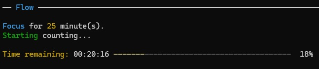
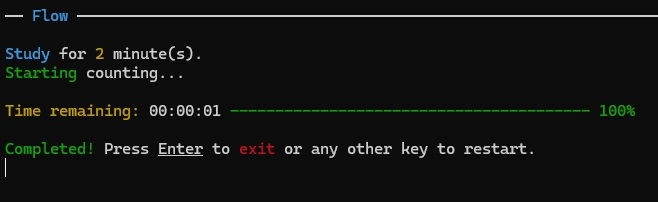
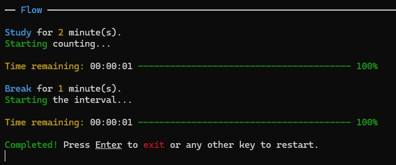

# Flow CLI

## Commands

* **Default run** (no arguments).
  - Pomodoro Mode.
  - Focus: 25 minutes.
  - Break: 5 minutes.

* **Custom run** (with arguments).
  - Required: `flow <name> <minutes>`.
  - Optional: `--break <minutes>` or `-b <minutes>`.
    - If you skip it, there won’t be a break.

### Examples:

- **Default Pomodoro**: `flow`  

- **Custom (no break)**: `flow Study 2`  

- **Custom (with break)**: `flow Study 2 -b 1`  

